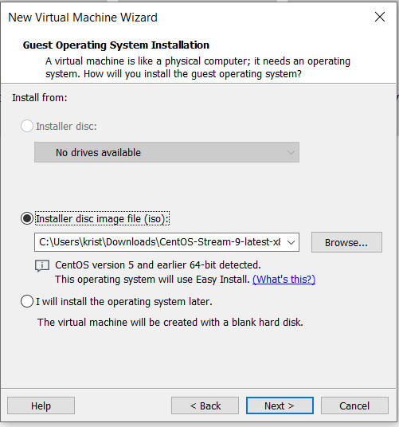
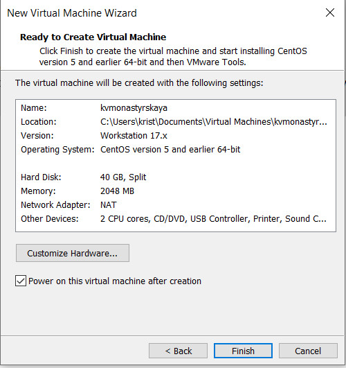
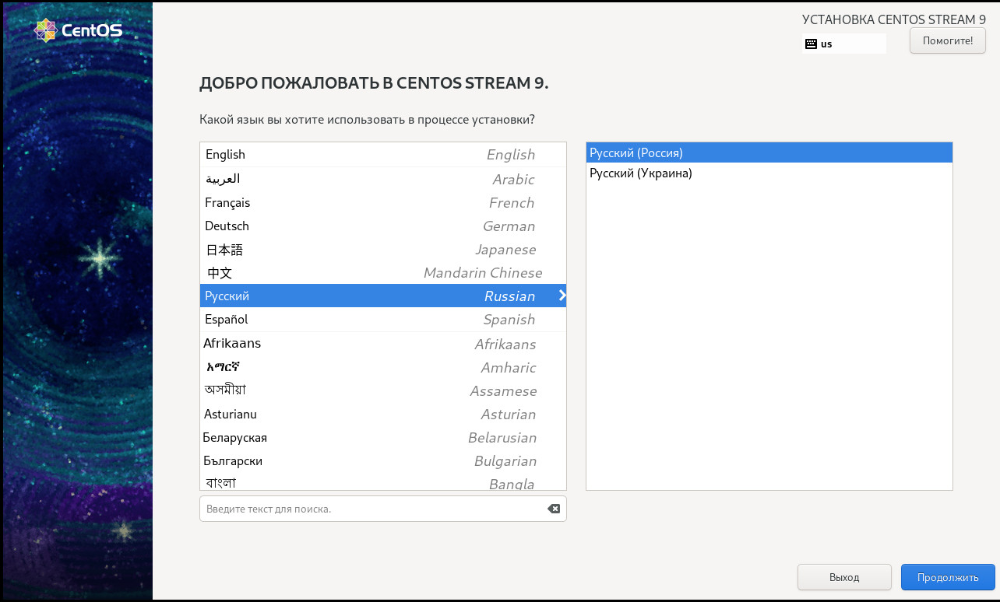
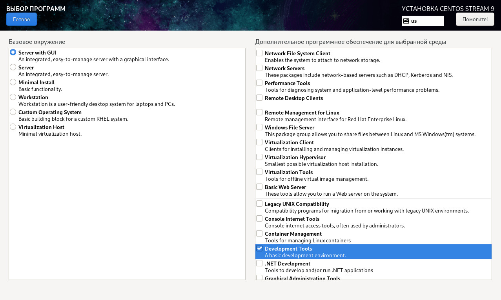
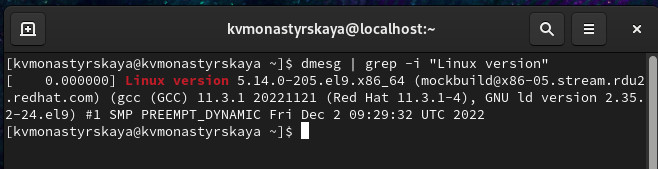
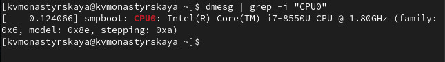

---
## Front matter
lang: ru-RU
title: "Лабораторная работа №1"
subtitle: "Установка и конфигурация операционной системы на виртуальную машину"
author:
    Монастырская Кристина Владимировна
    НПИбд-02-19\inst{1}
institute: |
	\inst{1}RUDN University, Moscow, Russian Federation
date: 2022, 19 December, Moscow, Russian Federation  

## Formatting
mainfont: PT Serif
romanfont: PT Serif
sansfont: PT Sans
monofont: PT Mono
toc: false
slide_level: 2
theme: metropolis
header-includes: 
 - \metroset{progressbar=frametitle,sectionpage=progressbar,numbering=fraction}
 - '\makeatletter'
 - '\beamer@ignorenonframefalse'
 - '\makeatother'
 - \usepackage[T2A]{fontenc}
 - \usepackage{amsmath}
aspectratio: 43
section-titles: true
---

# Цель работы
Целью данной работы является приобретение практических навыков
установки операционной системы на виртуальную машину, настройки минимально необходимых для дальнейшей работы сервисов.

# Создание новой виртуальной машины

{ #fig:001 width=70% }

# Создание новой виртуальной машины

{ #fig:002 width=70% }

# Задание размера основной памяти виртуальной машины

{ #fig:003 width=70% }

# Задание размера диска.

{ #fig:004 width=70% }

# Итоговые настройки виртуальной машины

{ #fig:004 width=70% }

# Выбор языка интерфейса

{ #fig:006 width=70% }

# Место установки ОС

{ #fig:007 width=70% }

# Задание базового окружения и дополнений

{ #fig:008 width=70% }

# Установка хостнейма

После завершения установки операционной системы корректно перезапустила виртуальную машину и установила корректное имя хоста. [-@fig:009])
{ #fig:009 width=70% }

# Домашнее задание
Дождитесь загрузки графического окружения и откройте терминал. В окне
терминала проанализируйте последовательность загрузки системы. 
Получите следующую информацию:

1. Версия ядра Linux (Linux version).
2. Частота процессора (Detected Mhz processor).
3. Модель процессора (CPU0).
4. Объем доступной оперативной памяти (Memory available).
5. Тип обнаруженного гипервизора (Hypervisor detected).
6. Тип файловой системы корневого раздела.
7. Последовательность монтирования файловых систем.

# Версия ядра Linux

{ #fig:010 width=70%}

# Частота процессора

{ #fig:011 width=70% }

# Модель процессора

{ #fig:012 width=70% }

# Объем доступной оперативной памяти

{ #fig:013 width=70% }

# Тип обнаруженного гипервизора

{ #fig:014 width=70% }

# Тип файловой системы корневого раздела

{ #fig:015 width=70% }

# Последовательность монтирования файловых систем

{ #fig:016 width=70% }

# Вывод
Установили операционную систему Linux на виртуальную машину и настроили необходимые сервисы. 

# Список литературы {.unnumbered}
1. [Лабораторная работа № 1. Установка и конфигурация операционной системы на виртуальную машину](https://esystem.rudn.ru/pluginfile.php/1652016/mod_folder/content/0/001-lab_virtualbox.pdf?forcedownload=1)