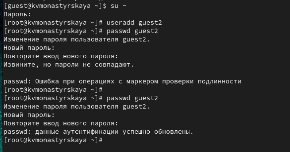
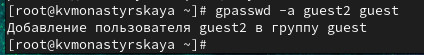
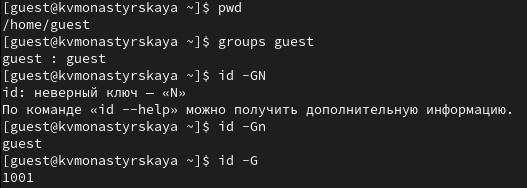
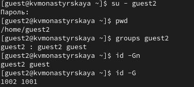
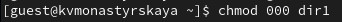
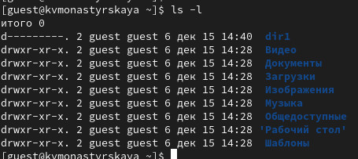

---
## Front matter
title: "Лабораторная работа №3"
subtitle: "Дискреционное разграничение прав в Linux. Два пользователя."
author: "Монастырская Кристина Владимировна"

## Generic options
lang: ru-RU
toc-title: "Содержание"

## Bibliography
bibliography: bib/cite.bib
csl: pandoc/csl/gost-r-7-0-5-2008-numeric.csl

## Pdf output format
toc: true # Table of contents
toc-depth: 2
lof: true # List of figures
lot: true # List of tables
fontsize: 12pt
linestretch: 1.5
papersize: a4
documentclass: scrreprt
## I18n polyglossia
polyglossia-lang:
  name: russian
  options:
	- spelling=modern
	- babelshorthands=true
polyglossia-otherlangs:
  name: english
## I18n babel
babel-lang: russian
babel-otherlangs: english
## Fonts
mainfont: PT Serif
romanfont: PT Serif
sansfont: PT Sans
monofont: PT Mono
mainfontoptions: Ligatures=TeX
romanfontoptions: Ligatures=TeX
sansfontoptions: Ligatures=TeX,Scale=MatchLowercase
monofontoptions: Scale=MatchLowercase,Scale=0.9
## Biblatex
biblatex: true
biblio-style: "gost-numeric"
biblatexoptions:
  - parentracker=true
  - backend=biber
  - hyperref=auto
  - language=auto
  - autolang=other*
  - citestyle=gost-numeric
## Pandoc-crossref LaTeX customization
figureTitle: "Рис."
tableTitle: "Таблица"
listingTitle: "Листинг"
lofTitle: "Список иллюстраций"
lotTitle: "Список таблиц"
lolTitle: "Листинги"
## Misc options
indent: true
header-includes:
  - \usepackage{indentfirst}
  - \usepackage{float} # keep figures where there are in the text
  - \floatplacement{figure}{H} # keep figures where there are in the text
---

# Цель работы

Получение практических навыков работы в консоли с атрибутами файлов для групп пользователей[[1]](#список-литературы).

# Выполнение лабораторной работы

1. Создала учётную запись пользователя guest2, используя учётную запись администратора(рис. 1 -@fig:001)   
useradd guest2  
passwd guest

{ #fig:001 width=80% height=80% }

2. Добавила пользователя guest2 в группу guest(рис. 2 -@fig:002) 
gpasswd -a guest2 guest  

{ #fig:002 width=80% height=80% }

3. Вошла в систему от двух пользователей на двух разных консолях и командой pwd определила директорию, в которой нахожусь.
Уточнила имя пользователя guest, его группу, кто входит в неё и к каким группам принадлежит он сам. 
Определила командой groups guest, в какие группы входят пользователи guest.
Сравнила вывод команды groups с выводом команд id -Gn и id -G для пользователя guest (рис. 3 -@fig:003)
{ #fig:003 width=80% height=80% }

5. Уточнила имя пользователя guest2, его группу, кто входит в неё и к каким группам принадлежит он сам  
Определила командой groups guest2, в какие группы входят пользователи guest2(рис. 4 -@fig:004) ([рис. 5](../../image/5.png))  
Сравнила вывод команды groups с выводом команд id -Gn и id -G для пользователя guest2 (рис. 4 -@fig:004)
{ #fig:004 width=80% height=80% }

6. Сравнила полученную информацию с содержимым файла (рис. 5 -@fig:005)

{ #fig:005 width=60% height=60% }

7. От имени пользователя guest2 выполнила регистрацию пользователя guest2 в группе guest командой newgrp guest(рис. 6 -@fig:006)

{ #fig:006 width=80% height=80% }

8. От имени пользователя guest изменила права директории /home/guest, разрешив все действия для пользователей группы: chmod g+rwx /home/guest(рис. 7 -@fig:007)

{ #fig:010 width=60% height=60% }

9. От имени пользователя guest сняла с директории /home/guest/dir1 все атрибуты командой chmod 000 dirl(рис. 8 -@fig:008), и проверила правильность снятия атрибутов(рис. 9 -@fig:009)

{ #fig:008 width=60% height=60% }  

{ #fig:009 width=80% height=80% }

Меняя атрибуты у директории dir1 и файла file1 от имени пользователя guest и делая проверку от пользователя guest2, заполнила табл. 1, определив опытным путём, какие операции разрешены, а какие нет. Если операция разрешена, заносила в таблицу знак «+», если не разрешена, знак «-».

: Установленные права и разрешённые действия для групп

|Права директории|Права файла|Создание файла|Удаление файла|Запись в файл|Чтение из файла|Смена директории|Просмотр файлов в директории|Переименование файла|Смена атрибутов файла|
|   :---:  |   :---:  |:---:|:---:|:---:|:---:|:---:|:---:|:---:|:---:|
|```d---```|```----```| - | - | - | - | - | - | - | - |
|```d--x```|```----```| - | - | - | - | + | - | - | - |
|```d-w-```|```----```| - | - | - | - | - | - | - | - |
|```d-wx```|```----```| + | + | - | - | + | - | + | - |
|```dr--```|```----```| - | - | - | - | - | + | - | - |
|```dr-x```|```----```| - | - | - | - | + | + | - | - |
|```drw-```|```----```| - | - | - | - | - | + | - | - |
|```drwx```|```----```| + | + | - | - | + | + | + | - |
|```d---```|```---x```| - | - | - | - | - | - | - | - |
|```d--x```|```---x```| - | - | - | - | + | - | - | - |
|```d-w-```|```---x```| - | - | - | - | - | - | - | - |
|```d-wx```|```---x```| + | + | - | - | + | - | + | - |
|```dr--```|```---x```| - | - | - | - | - | + | - | - |
|```dr-x```|```---x```| - | - | - | - | + | + | - | - |
|```drw-```|```---x```| - | - | - | - | - | + | - | - |
|```drwx```|```---x```| + | + | - | - | + | + | + | - |
|```d---```|```--w-```| - | - | - | - | - | - | - | - |
|```d--x```|```--w-```| - | - | + | - | + | - | - | - |
|```d-w-```|```--w-```| - | - | - | - | - | - | - | - |
|```d-wx```|```--w-```| + | + | + | - | + | - | + | - |
|```dr--```|```--w-```| - | - | - | - | - | + | - | - |
|```dr-x```|```--w-```| - | - | + | - | + | + | - | - |
|```drw-```|```--w-```| - | - | - | - | - | + | - | - |
|```drwx```|```--w-```| + | + | + | - | + | + | + | - |
|```d---```|```--wx```| - | - | - | - | - | - | - | - |
|```d--x```|```--wx```| - | - | + | - | + | - | - | - |
|```d-w-```|```--wx```| - | - | - | - | - | - | - | - |
|```d-wx```|```--wx```| + | + | + | - | + | - | + | - |
|```dr--```|```--wx```| - | - | - | - | - | + | - | - |
|```dr-x```|```--wx```| - | - | + | - | + | + | - | - |
|```drw-```|```--wx```| - | - | - | - | - | + | - | - |
|```drwx```|```--wx```| + | + | + | - | + | + | + | - |
|```d---```|```-r--```| - | - | - | - | - | - | - | - |
|```d--x```|```-r--```| - | - | - | + | + | - | - | - |
|```d-w-```|```-r--```| - | - | - | - | - | - | - | - |
|```d-wx```|```-r--```| + | + | - | + | + | - | + | - |
|```dr--```|```-r--```| - | - | - | - | - | + | - | - |
|```dr-x```|```-r--```| - | - | - | + | + | + | - | - |
|```drw-```|```-r--```| - | - | - | - | - | + | - | - |
|```drwx```|```-r--```| + | + | - | + | + | + | + | - |
|```d---```|```-r-x```| - | - | - | - | - | - | - | - |
|```d--x```|```-r-x```| - | - | - | + | + | - | - | - |
|```d-w-```|```-r-x```| - | - | - | - | - | - | - | - |
|```d-wx```|```-r-x```| + | + | - | + | + | - | + | - |
|```dr--```|```-r-x```| - | - | - | - | - | + | - | - |
|```dr-x```|```-r-x```| - | - | - | + | + | + | - | - |
|```drw-```|```-r-x```| - | - | - | - | - | + | - | - |
|```drwx```|```-r-x```| + | + | - | + | + | + | + | - |
|```d---```|```-rw-```| - | - | - | - | - | - | - | - |
|```d--x```|```-rw-```| - | - | + | + | + | - | - | - |
|```d-w-```|```-rw-```| - | - | - | - | - | - | - | - |
|```d-wx```|```-rw-```| + | + | + | + | + | - | + | - |
|```dr--```|```-rw-```| - | - | - | - | - | + | - | - |
|```dr-x```|```-rw-```| - | - | + | + | + | + | - | - |
|```drw-```|```-rw-```| - | - | - | - | - | + | - | - |
|```drwx```|```-rw-```| + | + | + | + | + | + | + | - |
|```d---```|```-rwx```| - | - | - | - | - | - | - | - |
|```d--x```|```-rwx```| - | - | + | + | + | - | - | - |
|```d-w-```|```-rwx```| - | - | - | - | - | - | - | - |
|```d-wx```|```-rwx```| + | + | + | + | + | - | + | - |
|```dr--```|```-rwx```| - | - | - | - | - | + | - | - |
|```dr-x```|```-rwx```| - | - | + | + | + | + | - | - |
|```drw-```|```-rwx```| - | - | - | - | - | + | - | - |
|```drwx```|```-rwx```| + | + | + | + | + | + | + | - |

15. На основании заполненной таблицы определила те или иные минимально необходимые права для выполнения пользователем guest2 операций внутри директории dir1 и заполнила табл. 2

: Минимальные права для совершения операций от имени пользователей входящих в группу


|Операция	       |Права на директорию |Права на файл|
|:--------------------:|:------------------:|:-----------:|
|Создание файла        |```d-wx```|```---```  |	    
|Удаление файла        |```d-wx```|```---```  |
|Чтение файла	       |```d--x```|```r--```  |
|Запись в файл	       |```d--x```|  ```-w-```  |
|Переименование файла  |```d-wx```|  ```---```  |
|Создание поддиректории|```d-wx```|  ```---```  |
|Удаление поддиректории|```d-wx```|  ```---```  |

# Выводы

Получили навыки работы в консоли с атрибутами файлов для групп пользователей.

# Список литературы{.unnumbered}

1. [Основы безопасности информационных систем : Учеб. пособие для студентов вузов, обучающихся по специальностям "Компьютер. безопасность" и "Комплекс. обеспечение информ. безопасности автоматизир. систем" / Д.А. Зегжда, А.М. Ивашко. - М. : Горячая линия - Телеком, 2000. - 449, [2] с. : ил., табл.; 21 см.; ISBN 5-93517-018-3](https://search.rsl.ru/ru/record/01000682756).

::: {#refs}
:::