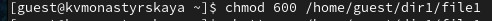
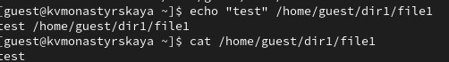
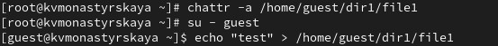

---
## Front matter
title: "Лабораторная работа №4"
subtitle: "Дискреционное разграничение прав в Linux. Расширенные атрибуты."
author: "Монастырская Кристина Владимировна"

## Generic options
lang: ru-RU
toc-title: "Содержание"

## Bibliography
bibliography: bib/cite.bib
csl: pandoc/csl/gost-r-7-0-5-2008-numeric.csl

## Pdf output format
toc: true # Table of contents
toc-depth: 2
lof: true # List of figures
lot: false # List of tables
fontsize: 12pt
linestretch: 1.5
papersize: a4
documentclass: scrreprt
## I18n polyglossia
polyglossia-lang:
  name: russian
  options:
	- spelling=modern
	- babelshorthands=true
polyglossia-otherlangs:
  name: english
## I18n babel
babel-lang: russian
babel-otherlangs: english
## Fonts
mainfont: PT Serif
romanfont: PT Serif
sansfont: PT Sans
monofont: PT Mono
mainfontoptions: Ligatures=TeX
romanfontoptions: Ligatures=TeX
sansfontoptions: Ligatures=TeX,Scale=MatchLowercase
monofontoptions: Scale=MatchLowercase,Scale=0.9
## Biblatex
biblatex: true
biblio-style: "gost-numeric"
biblatexoptions:
  - parentracker=true
  - backend=biber
  - hyperref=auto
  - language=auto
  - autolang=other*
  - citestyle=gost-numeric
## Pandoc-crossref LaTeX customization
figureTitle: "Рис."
tableTitle: "Таблица"
listingTitle: "Листинг"
lofTitle: "Список иллюстраций"
lotTitle: "Список таблиц"
lolTitle: "Листинги"
## Misc options
indent: true
header-includes:
  - \usepackage{indentfirst}
  - \usepackage{float} # keep figures where there are in the text
  - \floatplacement{figure}{H} # keep figures where there are in the text
---

# Цель работы

Получение практических навыков работы в консоли с расширенными
атрибутами файлов[[1]](#список-литературы).

# Выполнение лабораторной работы

1. От имени пользователя guest определила расширенные атрибуты файла /home/guest/dir1/file1 командой lsattr /home/guest/dir1/file1 ([рис. 1](../images/1.jpg)).

{ #fig:001 width=80% height=80% }

2. Установила командой chmod 600 file1 на файл file1 права, разрешающие чтение и запись для владельца файла ([рис. 2](../images/2.jpg)).

{ #fig:002 width=80% height=80% }

3. Попробовала установить на файл /home/guest/dir1/file1 расширенный атрибут a от имени пользователя guest: chattr +a /home/guest/dir1/file1 ([рис. 3](../../image/3.png)).
В ответ получила отказ в выполнении операции.
Попробовала установить расширенный атрибут a на файл /home/guest/dir1/file1 от имени суперпользователя: chattr +a /home/guest/dir1/file1.

{ #fig:003 width=80% height=80% }

5. От пользователя guest проверила правильность установления атрибута: lsattr /home/guest/dir1/file1 ([рис. 4](../images/4.jpg)).

{ #fig:004 width=80% height=80% }

6. Выполнила дозапись в файл file1 слова «test» командой echo "test" >> /home/guest/dir1/file1 и выполнила чтение файла file1 командой cat /home/guest/dir1/file1 ([рис. 5](../images/5.jpg)).

{ #fig:005 width=80% height=80% }

7. Попробовала удалить файл file1.
Попробовала переименовать файл ([рис. 6](../images/6.jpg)).

{ #fig:006 width=80% height=80% }

Попробовала перезаписать файл ([рис. 7](../images/7.jpg)).

{ #fig:001 width=80% height=80% }

8. Попробовала с помощью команды chmod 000 file1 установить на файл file1 права, запрещающие чтение и запись для владельца файла ([рис. 8](../images/7.jpg)).

{ #fig:007 width=80% height=80% }

9. Сняла расширенный атрибут a с файла /home/guest/dirl/file1 от имени суперпользователя командой chattr -a /home/guest/dir1/file1 ([рис. 9](../images/8.jpg)).

{ #fig:008 width=80% height=80% }

Повторила операции, которые ранее не удавалось выполнить ([рис. 10](../images/9.jpg)).

{ #fig:009 width=80% height=80% }

Теперь у нас есть возможность менять права доступа, название файла, а также можем его удалить.

10. Повторила свои действия, заменив атрибут «a» атрибутом «i» ([рис. 11]../images/10.jpg)).

{ #fig:010 width=80% height=80% }

На этот раз мы не можем производить никакие действия над файлом, в том числе и дозапись 

# Выводы

В результате выполнения работы вы повысили свои навыки использования интерфейса командой строки (CLI), познакомились на примерах с тем, как используются основные и расширенные атрибуты при разграничении доступа. Имели возможность связать теорию дискреционного разделения доступа (дискреционная политика безопасности) с её реализацией на практике в ОС Linux. Опробовали на практике действие расширенных атрибутов «а» и «i».

# Список литературы{.unnumbered}

1. [Основы безопасности информационных систем : Учеб. пособие для студентов вузов, обучающихся по специальностям "Компьютер. безопасность" и "Комплекс. обеспечение информ. безопасности автоматизир. систем" / Д.А. Зегжда, А.М. Ивашко. - М. : Горячая линия - Телеком, 2000. - 449, [2] с. : ил., табл.; 21 см.; ISBN 5-93517-018-3](https://search.rsl.ru/ru/record/01000682756).

::: {#refs}
:::