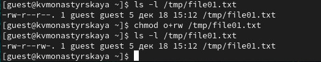

---
## Front matter
lang: ru-RU
title: "Лабораторная работа №5"
subtitle: "Дискреционное разграничение прав в Linux. Исследование влияния дополнительных атрибутов."
author:
    Монастырская Кристина Владимировна
    НПИбд-02-19\inst{1}
institute: |
	\inst{1}RUDN University, Moscow, Russian Federation
date: 2022, 19 March, Moscow, Russian Federation  

## Formatting
mainfont: PT Serif
romanfont: PT Serif
sansfont: PT Sans
monofont: PT Mono
toc: false
slide_level: 2
theme: metropolis
header-includes: 
 - \metroset{progressbar=frametitle,sectionpage=progressbar,numbering=fraction}
 - '\makeatletter'
 - '\beamer@ignorenonframefalse'
 - '\makeatother'
 - \usepackage[T2A]{fontenc}
 - \usepackage{amsmath}
aspectratio: 43
section-titles: true
---

# Цель работы

Изучение механизмов изменения идентификаторов, применения SetUID- и Sticky-битов. Получение практических навыков работы в консоли с дополнительными атрибутами. Рассмотрение работы механизма смены идентификатора процессов пользователей, а также влияние бита Sticky на запись и удаление файлов.

# Создала программу simpleid.c

{ #fig:001 width=80% height=80% }

# Компилирование и запуск программы

{ #fig:002 width=80% height=80% }

# Усложнение программы

{ #fig:003 width=80% height=80% }

# Работа второй программы 

{ #fig:007 width=80% height=80% }

# Смена владельца и группы файла simpleid2 и его прав доступа

{ #fig:008 width=80% height=80% }

# Правильность установки новых атрибутов

{ #fig:010 width=80% height=80% }

# Проделали тоже самое относительно SetGID-бита

{ #fig:011 width=80% height=80% }

# Программа readfile.c 

{ #fig:012 width=80% height=80% }

# Компиляция readfile.c

{ #fig:013 width=80% height=80% }

# Смена владельца файла readfile.c

{ #fig:014 width=80% height=80% }

# Изменение прав

{ #fig:015 width=80% height=80% }

# Проверка

{ #fig:016 width=80% height=80% }

# Смена владельца и установка SetUID-бит

{ #fig:017 width=80% height=80% }

# Выполнение программы reafile

{ #fig:019 width=80% height=80% }

# Чтение файла /etc/shadow

{ #fig:019 width=80% height=80% }

# Наличие атрибута Sticky на директории /tmp

{ #fig:020 width=80% height=80% }

# Создали файл file01.txt в директории /tmp со словом test

{ #fig:021 width=80% height=80% }

# Чтение и запись для категории пользователей «все остальные»

{ #fig:022 width=80% height=80% }

# От пользователя guest2 прочитали файл /tmp/file01.txt

{ #fig:023 width=80% height=80% }

# От пользователя guest2 дозаписали файл /tmp/file01.txt

{ #fig:024 width=80% height=80% }

# От пользователя guest2 перезапись файла /tmp/file01.txt

{ #fig:025 width=80% height=80% }

# Попытка удалить файл /tmp/file01.txt

{ #fig:027 width=80% height=80% }

# От пользователя guest2 проверили, что атрибута t у директории /tmp нет

![Проверка атрибутов]](../images/30.jpg){ #fig:029 width=80% height=80% }

# Повторили предыдущие шаги

{ #fig:030 width=80% height=80% }

# Вывод

Изучили механизмы изменения идентификаторов, применения SetUID- и Sticky-битов.
