---
## Front matter
title: "Лабораторная работа №5"
subtitle: "Дискреционное разграничение прав в Linux. Исследование влияния дополнительных атрибутов."
author: "Монастырская Кристина Владимировна"

## Generic options
lang: ru-RU
toc-title: "Содержание"

## Bibliography
bibliography: bib/cite.bib
csl: pandoc/csl/gost-r-7-0-5-2008-numeric.csl

## Pdf output format
toc: true # Table of contents
toc-depth: 2
lof: true # List of figures
lot: false # List of tables
fontsize: 12pt
linestretch: 1.5
papersize: a4
documentclass: scrreprt
## I18n polyglossia
polyglossia-lang:
  name: russian
  options:
	- spelling=modern
	- babelshorthands=true
polyglossia-otherlangs:
  name: english
## I18n babel
babel-lang: russian
babel-otherlangs: english
## Fonts
mainfont: PT Serif
romanfont: PT Serif
sansfont: PT Sans
monofont: PT Mono
mainfontoptions: Ligatures=TeX
romanfontoptions: Ligatures=TeX
sansfontoptions: Ligatures=TeX,Scale=MatchLowercase
monofontoptions: Scale=MatchLowercase,Scale=0.9
## Biblatex
biblatex: true
biblio-style: "gost-numeric"
biblatexoptions:
  - parentracker=true
  - backend=biber
  - hyperref=auto
  - language=auto
  - autolang=other*
  - citestyle=gost-numeric
## Pandoc-crossref LaTeX customization
figureTitle: "Рис."
tableTitle: "Таблица"
listingTitle: "Листинг"
lofTitle: "Список иллюстраций"
lotTitle: "Список таблиц"
lolTitle: "Листинги"
## Misc options
indent: true
header-includes:
  - \usepackage{indentfirst}
  - \usepackage{float} # keep figures where there are in the text
  - \floatplacement{figure}{H} # keep figures where there are in the text
---

# Цель работы

Изучение механизмов изменения идентификаторов, применения SetUID- и Sticky-битов. Получение практических навыков работы в консоли с дополнительными атрибутами. Рассмотрение работы механизма смены идентификатора процессов пользователей, а также влияние бита Sticky на запись и удаление файлов [[1]](#список-литературы).

# Выполнение лабораторной работы

1. Вошла в систему от имени пользователя guest.

2. Создала программу simpleid.c ([рис. 1](../images/1.jpg)).

{ #fig:001 width=80% height=80% }

3. Скомплилировала программу и убедилась, что файл программы создан.([рис. 2](../images/2.jpg))

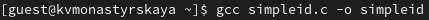{ #fig:002 width=80% height=80% }

4. Выполнила программу simpleid ([рис. 3](../images/3.jpg)).

{ #fig:003 width=80% height=80% }

5.  Выполнила системную программу id и сравнила полученный результат с данными предыдущего пункта задания.([рис. 4](../images/4.jpg))

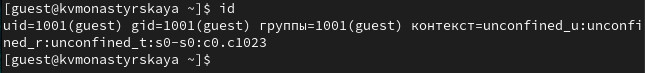{ #fig:004 width=80% height=80% }

6. Усложнила программу, добавив вывод действительных идентификаторов. Получившуюся программу назвала simpleid2.c([рис. 5](../images/5.jpg))

{ #fig:001 width=80% height=80% }

7. Скомпилируйте и запустите simpleid2.c:([рис. 6](../images/6.jpg))([рис. 7](../images/7.jpg))

{ #fig:006 width=80% height=80% }
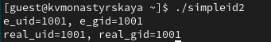{ #fig:007 width=80% height=80% }

8. От имени суперпользователя выполнила команды([рис. 8](../images/8.jpg)):

{ #fig:008 width=80% height=80% }

9.  Выполнила проверку правильности установки новых атрибутов и сменила владельца файла simpleid2:([рис. 2](../images/9.jpg))

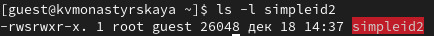{ #fig:009 width=80% height=80% }

10. Запустила simpleid2 и id([рис. 10](../images/11.jpg))

{ #fig:010 width=80% height=80% }

11. Проделала тоже самое относительно SetGID-бита.([рис. 11](../images/12.jpg))

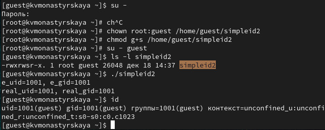{ #fig:011 width=80% height=80% }

12.  Создала программу readfile.c([рис. 12](../images/13.jpg)):

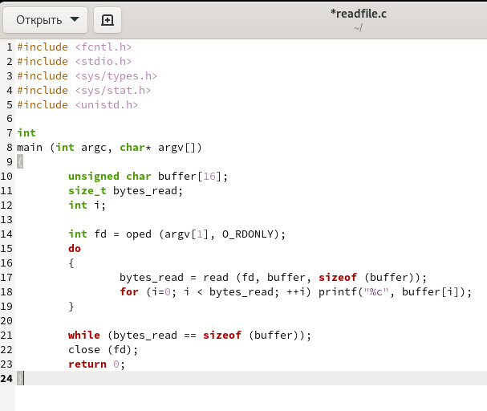{ #fig:012 width=80% height=80% }

13.  Откомпилировала её.([рис. 13](../images/14.jpg))

{ #fig:013 width=80% height=80% }

14.  Сменила владельца у файла readfile.c и изменила права так, чтобы только суперпользователь (root) мог прочитать его, a guest не мог.([рис. 14](../images/15.jpg))([рис. 15](../images/16.jpg))

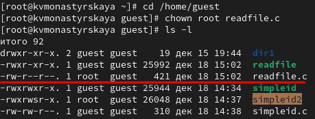{ #fig:014 width=80% height=80% }

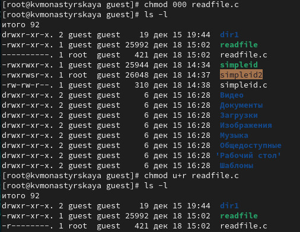{ #fig:015 width=80% height=80% }

15. Проверила, что пользователь guest не может прочитать файл readfile.c.([рис. 16](../images/17.jpg))

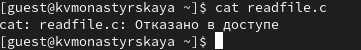{ #fig:016 width=80% height=80% }

16.  Сменила у программы readfile владельца и установила SetU’D-бит([рис. 17](../images/18.jpg))

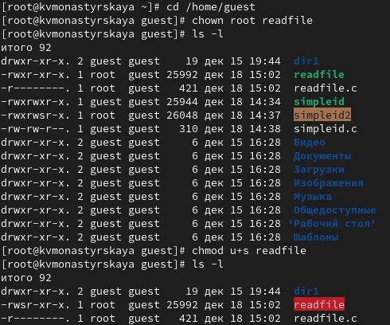{ #fig:017 width=80% height=80% }

17.  Проверила, может ли программа readfile прочитать файл readfile.c([рис. 18](../images/19.jpg))

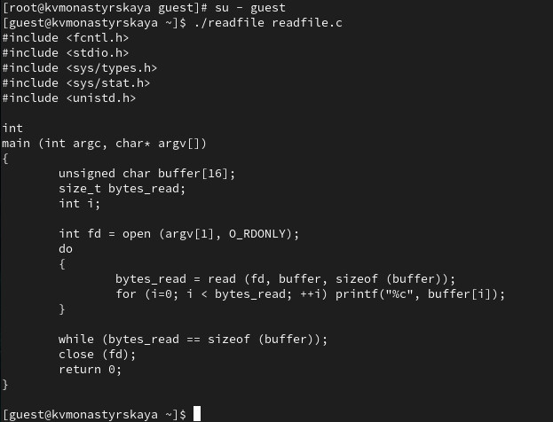{ #fig:018 width=80% height=80% }

18.  Проверила, может ли программа readfile прочитать файл /etc/shadow([рис. 19](../images/20.jpg))

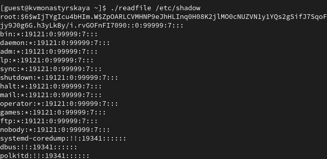{ #fig:019 width=80% height=80% }

19.  Выяснила, установлен ли атрибут Sticky на директории /tmp ([рис. 20](../images/21.jpg))

{ #fig:020 width=80% height=80% }

22. От имени пользователя guest создала файл file01.txt в директории /tmp со словом test: echo "test" > /tmp/file01.txt([рис. 21](../images/22.jpg))

{ #fig:021 width=80% height=80% }

23. Просмотрела атрибуты у только что созданного файла и разрешила чтение и запись для категории пользователей «все остальные»([рис. 22](../images/23.jpg)):
ls -l /tmp/file01.txt
chmod o+rw /tmp/file01.txt
ls -l /tmp/file01.txt

{ #fig:022 width=80% height=80% }

24. От пользователя guest2 (не являющегося владельцем) попробовала прочитать файл /tmp/file01.txt([рис. 23](../images/24.jpg)):

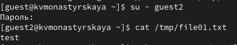{ #fig:023 width=80% height=80% }

25. От пользователя guest2 попробовала дозаписать в файл /tmp/file01.txt слово test2 командой echo "test2" > /tmp/file01.txt([рис. 24](../images/25.jpg))

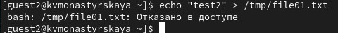{ #fig:024 width=80% height=80% }

26. От пользователя guest2 попробовала записать в файл /tmp/file01.txtслово test3, стерев при этом всю имеющуюся в файле информацию командой echo "test3" > /tmp/file01.txt([рис. 25](../images/27.jpg))

{ #fig:025 width=80% height=80% }

27. Проверила содержимое файла([рис. 26](../images/28.jpg))

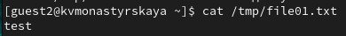{ #fig:026 width=80% height=80% }

28. От пользователя guest2 попробовала удалить файл /tmp/file01.txt([рис. 27](../images/29.jpg))

{ #fig:027 width=80% height=80% }

29. Повысила свои права до суперпользователя следующей командой([рис. 28](../images/1.jpg))
su -
и выполнила после этого команду, снимающую атрибут t (Sticky-бит) сдиректории /tmp:
chmod -t /tmp

31. Повторила предыдущие шаги([рис. 29](../images/30.jpg))

![Проверка атрибутов]](../images/30.jpg){ #fig:029 width=80% height=80% }

32. Теперь можем удалять файлы находящиеся в каталоге tmp.

33. Повысила свои права до суперпользователя и вернула атрибут t на директорию /tmp([рис. 30](../images/31.jpg)):
su -
chmod +t /tmp
exit

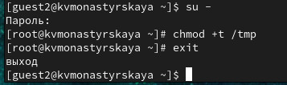{ #fig:030 width=80% height=80% }

# Выводы

Изучили механизмы изменения идентификаторов, применения SetUID- и Sticky-битов. 

# Список литературы{.unnumbered}

1. [Основы безопасности информационных систем : Учеб. пособие для студентов вузов, обучающихся по специальностям "Компьютер. безопасность" и "Комплекс. обеспечение информ. безопасности автоматизир. систем" / Д.А. Зегжда, А.М. Ивашко. - М. : Горячая линия - Телеком, 2000. - 449, [2] с. : ил., табл.; 21 см.; ISBN 5-93517-018-3](https://search.rsl.ru/ru/record/01000682756).

::: {#refs}
:::