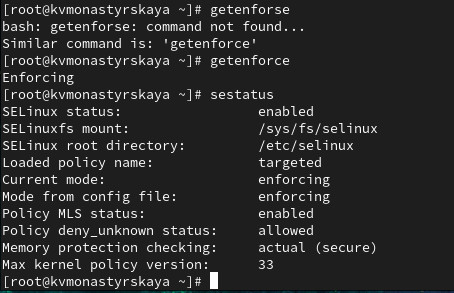
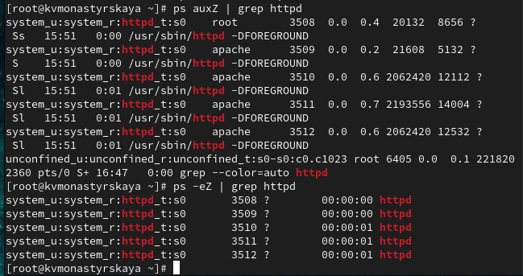
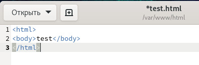
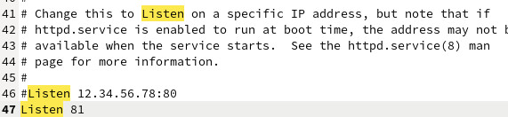
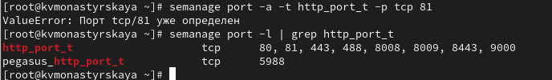
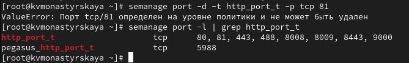
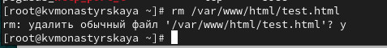

---
## Front matter
lang: ru-RU
title: "Лабораторная работа №6"
subtitle: "Мандатное разграничение прав в Linux"
author:
    Монастырская Кристина Владимировна
    НПИбд-02-19\inst{1}
institute: |
	\inst{1}RUDN University, Moscow, Russian Federation
date: 2022, 19 March, Moscow, Russian Federation  

## Formatting
mainfont: PT Serif
romanfont: PT Serif
sansfont: PT Sans
monofont: PT Mono
toc: false
slide_level: 2
theme: metropolis
header-includes: 
 - \metroset{progressbar=frametitle,sectionpage=progressbar,numbering=fraction}
 - '\makeatletter'
 - '\beamer@ignorenonframefalse'
 - '\makeatother'
 - \usepackage[T2A]{fontenc}
 - \usepackage{amsmath}
aspectratio: 43
section-titles: true
---

# Цель работы

Развить навыки администрирования ОС Linux. Получить первое практическое знакомство с технологией SELinux1. Проверить работу SELinux на практике совместно с веб-сервером Apache.

# Убедилась, что SELinux работает в режиме enforcing политики targeted

{ #fig:001 width=80% height=80% }

# Запустила веб-сервер

{ #fig:001 width=80% height=80% }

# Нашла веб-сервер Apache в списке процессов

{ #fig:001 width=80% height=80% }

# Текущее состояние переключателей SELinux для Apache

{ #fig:001 width=80% height=80% }

# Статистика по политике

{ #fig:001 width=80% height=80% }

# Тип поддиректорий в директории /var/www 

{ #fig:001 width=80% height=80% }

# Круг пользователей с разрешением на создание файлов в /var/www/html

{ #fig:001 width=80% height=80% }

# Создала html-файл /var/www/html/test.html

{ #fig:001 width=80% height=80% }

# Проверила контекст созданного файла

{ #fig:001 width=80% height=80% }

# Обратилась к файлу через веб-сервер

{ #fig:001 width=80% height=80% }

# Изменила контекст файла /var/www/html/test.html

{ #fig:001 width=80% height=80% }

# Обратилась к файлу через веб-сервер

{ #fig:001 width=80% height=80% }

# Log-файлы веб-сервера Apache

{ #fig:001 width=80% height=80% }

# Посмотрела системный лог-файл

{ #fig:001 width=80% height=80% }

# Запустила веб-сервер Apache на прослушивание ТСР-порта
81

{ #fig:001 width=80% height=80% }

# Добавила порт 81 в список портов

{ #fig:001 width=80% height=80% }

# Вернула контекст httpd_sys_cоntent__t и обратилась к файлу через веб-сервер

{ #fig:001 width=80% height=80% }

# Исправила конфигурационный файл apache

{ #fig:001 width=80% height=80% }

# Попробовала удалить привязку http_port_t к 81 порту

{ #fig:001 width=80% height=80% }

# Удалила файл /var/www/html/test.html

{ #fig:001 width=80% height=80% }

# Вывод

Получили практическое знакомство с технологией SELinux1. Проверили работу SELinx на практике совместно с веб-сервером Apache.
