---
## Front matter
title: "Лабораторная работа №6"
subtitle: "Мандатное разграничение прав в Linux"
author: "Монастырская Кристина Владимировна"

## Generic options
lang: ru-RU
toc-title: "Содержание"

## Bibliography
bibliography: bib/cite.bib
csl: pandoc/csl/gost-r-7-0-5-2008-numeric.csl

## Pdf output format
toc: true # Table of contents
toc-depth: 2
lof: true # List of figures
lot: false # List of tables
fontsize: 12pt
linestretch: 1.5
papersize: a4
documentclass: scrreprt
## I18n polyglossia
polyglossia-lang:
  name: russian
  options:
	- spelling=modern
	- babelshorthands=true
polyglossia-otherlangs:
  name: english
## I18n babel
babel-lang: russian
babel-otherlangs: english
## Fonts
mainfont: PT Serif
romanfont: PT Serif
sansfont: PT Sans
monofont: PT Mono
mainfontoptions: Ligatures=TeX
romanfontoptions: Ligatures=TeX
sansfontoptions: Ligatures=TeX,Scale=MatchLowercase
monofontoptions: Scale=MatchLowercase,Scale=0.9
## Biblatex
biblatex: true
biblio-style: "gost-numeric"
biblatexoptions:
  - parentracker=true
  - backend=biber
  - hyperref=auto
  - language=auto
  - autolang=other*
  - citestyle=gost-numeric
## Pandoc-crossref LaTeX customization
figureTitle: "Рис."
tableTitle: "Таблица"
listingTitle: "Листинг"
lofTitle: "Список иллюстраций"
lotTitle: "Список таблиц"
lolTitle: "Листинги"
## Misc options
indent: true
header-includes:
  - \usepackage{indentfirst}
  - \usepackage{float} # keep figures where there are in the text
  - \floatplacement{figure}{H} # keep figures where there are in the text
---

# Цель работы

Развить навыки администрирования ОС Linux. Получить первое практическое знакомство с технологией SELinux1. Проверить работу SELinux на практике совместно с веб-сервером Apache. [[1]](#список-литературы)

# Выполнение лабораторной работы

1. Вошла в систему с полученными учётными данными и убедилась, что
SELinux работает в режиме enforcing политики targeted с помощью команд getenforce и sestatus. ([рис. 1](../images/1.jpg))

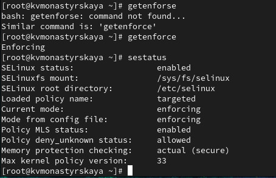{ #fig:001 width=80% height=80% }

2. Запустила веб-сервер. Обратилась с помощью браузера к веб-серверу, запущенному на компьютере, и убедилась, что последний работает: service httpd status. ([рис. 2](../images/2.jpg)).

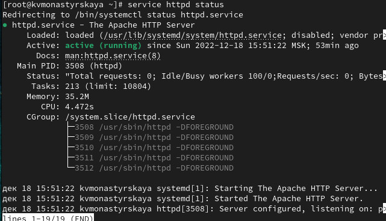{ #fig:001 width=80% height=80% }

3. Нашла веб-сервер Apache в списке процессов. ([рис. 3](../images/3.jpg)).

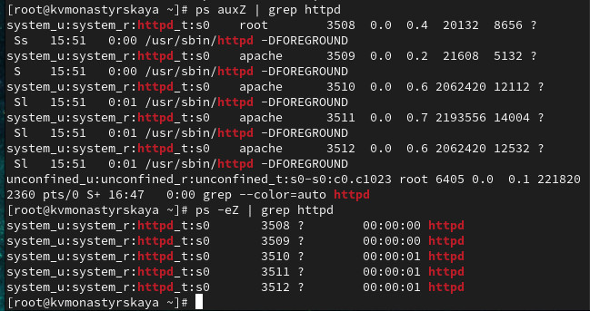{ #fig:001 width=80% height=80% }

Контекст безопасности: system_u:system_r:httpd_t:s0

4. Посмотрела текущее состояние переключателей SELinux для Apache с
помощью команды sestatus -b | grep httpd. ([рис. 4](../images/4.jpg)).

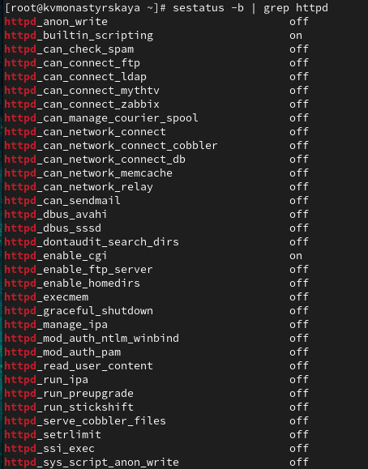{ #fig:001 width=80% height=80% }

Многие из них находятся в положении «off»

5. Посмотрела статистику по политике с помощью команды seinfo. ([рис. 5](../images/5.jpg)).

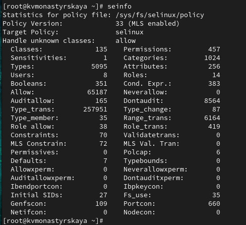{ #fig:001 width=80% height=80% }

Множество пользователей - 8  
Ролей - 14
Типов - 5002

6. Определила тип файлов и поддиректорий, находящихся в директории
/var/www, с помощью команды ls -lZ /var/www ([рис. 6](../images/6.jpg)).

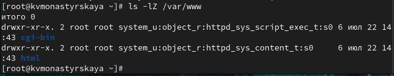{ #fig:001 width=80% height=80% }

7. Определила тип файлов, находящихся в директории /var/www/html:
ls -lZ /var/www/html ([рис. 7](../images/7.jpg)).

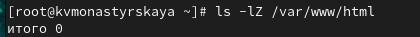{ #fig:001 width=80% height=80% }

8. Определила круг пользователей, которым разрешено создание файлов в
директории /var/www/html. ([рис. 8](../images/8.jpg)).

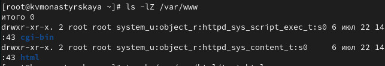{ #fig:001 width=80% height=80% }

Создавать файлы в директории может только её владелец.

9. Создала от имени суперпользователя (так как в дистрибутиве после установки только ему разрешена запись в директорию) html-файл
/var/www/html/test.html следующего содержания: ([рис. 9](../images/9.jpg)).

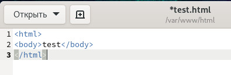{ #fig:001 width=80% height=80% }

10. Проверила контекст созданного файла. ([рис. 10](../images/10.jpg)).

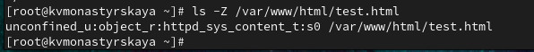{ #fig:001 width=80% height=80% }

Контекст безопасности (по умолчания для новых файлов в директории): nconfined_u:object_r:httpd_sys_content_t:s0

11. Обратилась к файлу через веб-сервер, введя в браузере адрес
http://127.0.0.1/test.html. ([рис. 11](../images/11.jpg)).

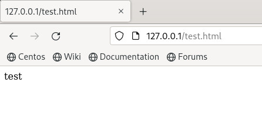{ #fig:001 width=80% height=80% }

12. Изучила справку man httpd_selinux ([рис. 12](../../image/12.png)).

13. Изменила контекст файла /var/www/html/test.html с httpd_sys_content_t на тот, к которому процесс httpd не имеет доступ (samba_share_t) ([рис. 13](../images/13.jpg)).

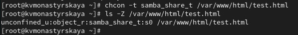{ #fig:001 width=80% height=80% }

14. Попробовала получить доступ к файлу через веб-сервер, введя в браузере адрес http://127.0.0.1/test.html. ([рис. 14](../images/14.jpg)).

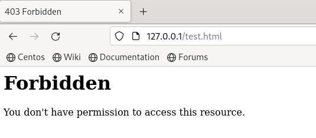{ #fig:001 width=80% height=80% }

Файл не отображен, так как к заданному типу контекста httpd не имеет доступа.

15. Просмотрела log-файлы веб-сервера Apache. ([рис. 15](../images/15.jpg))

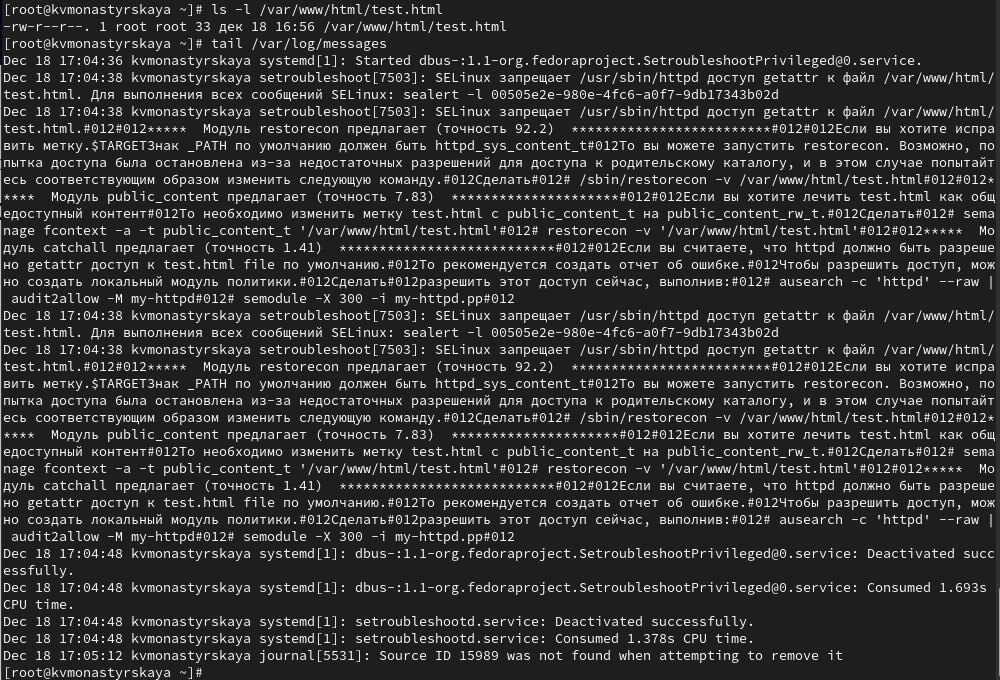{ #fig:001 width=80% height=80% }

Посмотрела системный лог-файл ([рис. 16](../images/15_1.jpg)).

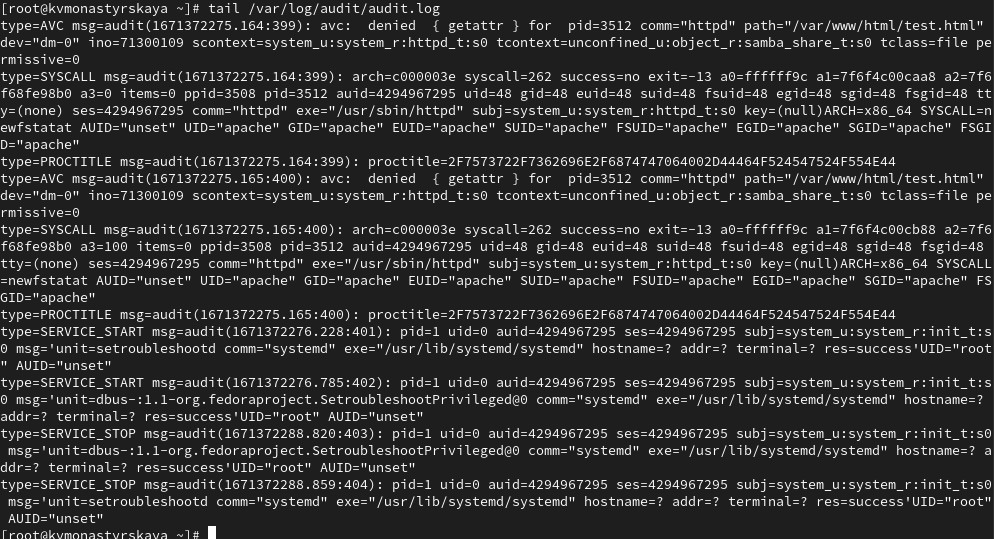{ #fig:001 width=80% height=80% }

Можем видеть как отображаются ошибки. 

16. Попробовала запустить веб-сервер Apache на прослушивание ТСР-порта
81 ([рис. 17](../images/16.jpg)).

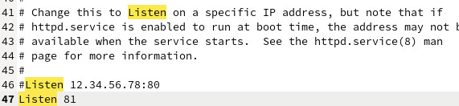{ #fig:001 width=80% height=80% }

17. Выполнила перезапуск веб-сервера Apache и посмотрела лог-файлы ([рис. 17](../images/17.jpg)-[рис. 20](../images/18_3.jpg)).

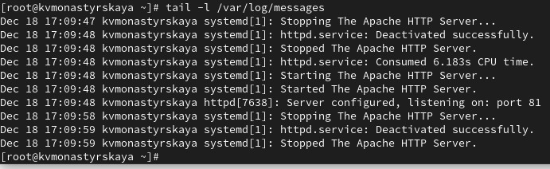{ #fig:001 width=80% height=80% }

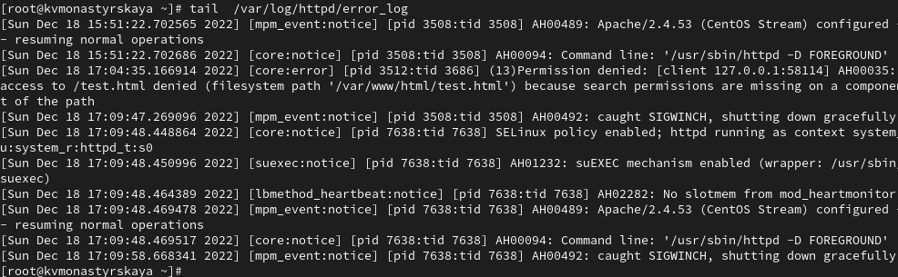{ #fig:001 width=80% height=80% }

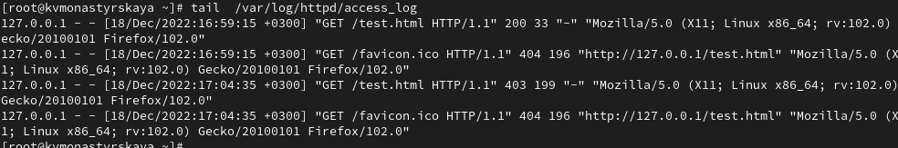{ #fig:001 width=80% height=80% }

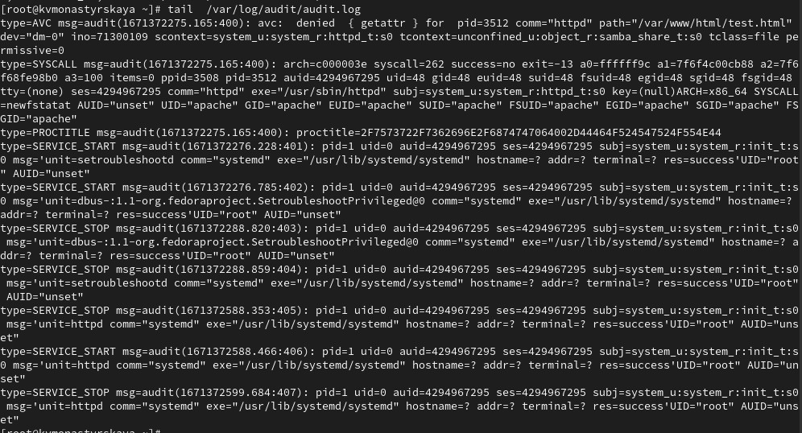{ #fig:001 width=80% height=80% }

18. Добавила порт 81 в список портов. ([рис. 21](../images/19.jpg)).

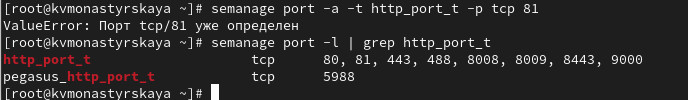{ #fig:001 width=80% height=80% }

19. Вернула контекст httpd_sys_cоntent__t к файлу /var/www/html/ test.html:.
Попробовала получить доступ к файлу через веб-сервер по 81 порту ([рис. 24](../images/21.jpg))
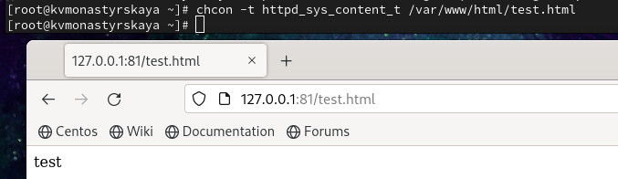{ #fig:001 width=80% height=80% }

20. Исправила обратно конфигурационный файл apache ([рис. 26](../images/22.jpg)).

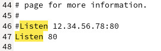{ #fig:001 width=80% height=80% }

21. Попробовала удалить привязку http_port_t к 81 порту ([рис. 27](../images/23.jpg)).

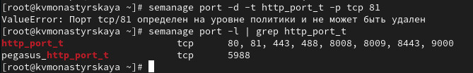{ #fig:001 width=80% height=80% }

22. Удалила файл /var/www/html/test.html ([рис. 28](../images/24.jpg)).

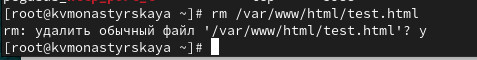{ #fig:001 width=80% height=80% }

# Выводы

Получили практическое знакомство с технологией SELinux1. Проверили работу SELinx на практике совместно с веб-сервером Apache.

# Список литературы{.unnumbered}

1. [Основы безопасности информационных систем : Учеб. пособие для студентов вузов, обучающихся по специальностям "Компьютер. безопасность" и "Комплекс. обеспечение информ. безопасности автоматизир. систем" / Д.А. Зегжда, А.М. Ивашко. - М. : Горячая линия - Телеком, 2000. - 449, [2] с. : ил., табл.; 21 см.; ISBN 5-93517-018-3](https://search.rsl.ru/ru/record/01000682756).

::: {#refs}
:::