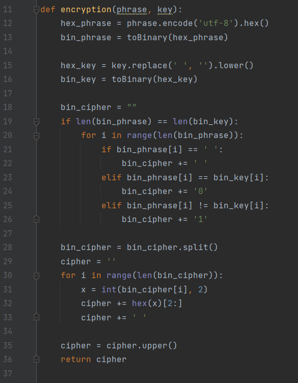
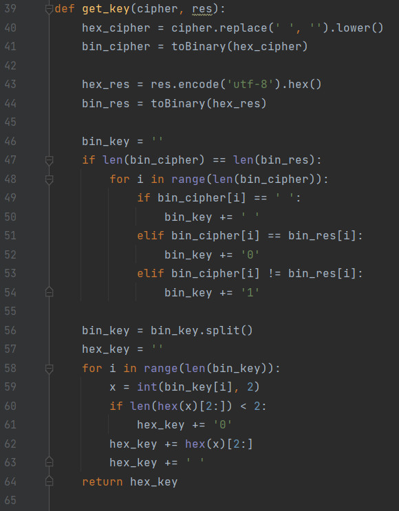
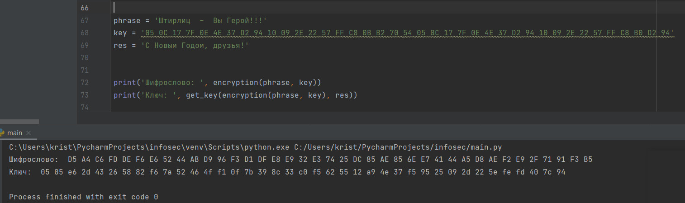

---
## Front matter
lang: ru-RU
title: "Лабораторная работа №7"
subtitle: "Элементы криптографии. Однократное гаммирование"
author:
    Монастырская Кристина Владимировна
    НПИбд-02-19\inst{1}
institute: |
	\inst{1}RUDN University, Moscow, Russian Federation
date: 2022, 19 March, Moscow, Russian Federation  

## Formatting
mainfont: PT Serif
romanfont: PT Serif
sansfont: PT Sans
monofont: PT Mono
toc: false
slide_level: 2
theme: metropolis
header-includes: 
 - \metroset{progressbar=frametitle,sectionpage=progressbar,numbering=fraction}
 - '\makeatletter'
 - '\beamer@ignorenonframefalse'
 - '\makeatother'
 - \usepackage[T2A]{fontenc}
 - \usepackage{amsmath}
aspectratio: 43
section-titles: true
---

# Цель работы

Освоить на практике применение режима однократного гаммирования.

# Программа шифровки

Приложение может:

1. Определять вид шифротекста при известном ключе и известном открытом тексте.  
2. Определить ключ, с помощью которого шифротекст может быть преобразован в некоторый фрагмент текста, представляющий собой один из
возможных вариантов прочтения открытого текста.

# Написали функцию encryption

{ #fig:001 width=80% height=80% }  

# Написали функцию get_key

{ #fig:002 width=80% height=80% }  

# Результат работы программы

{ #fig:003 width=80% height=80% }

# Вывод

Освоили на практике применение режима однократного гаммирования.