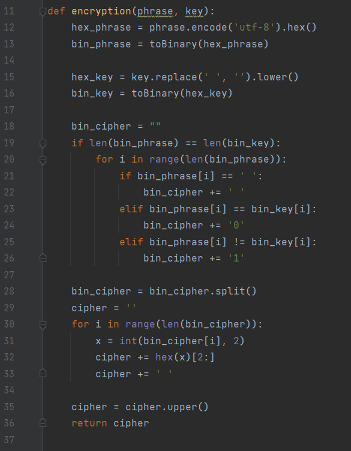
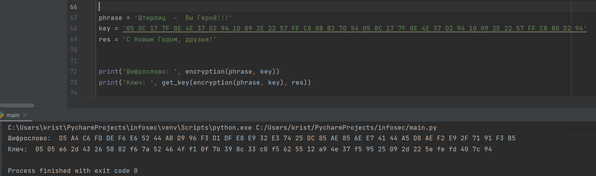

---
## Front matter
title: "Лабораторная работа №7"
subtitle: "Элементы криптографии. Однократное гаммирование"
author: "Монастырская Кристина Владимировна"

## Generic options
lang: ru-RU
toc-title: "Содержание"

## Bibliography
bibliography: bib/cite.bib
csl: pandoc/csl/gost-r-7-0-5-2008-numeric.csl

## Pdf output format
toc: true # Table of contents
toc-depth: 2
lof: true # List of figures
lot: false # List of tables
fontsize: 12pt
linestretch: 1.5
papersize: a4
documentclass: scrreprt
## I18n polyglossia
polyglossia-lang:
  name: russian
  options:
	- spelling=modern
	- babelshorthands=true
polyglossia-otherlangs:
  name: english
## I18n babel
babel-lang: russian
babel-otherlangs: english
## Fonts
mainfont: PT Serif
romanfont: PT Serif
sansfont: PT Sans
monofont: PT Mono
mainfontoptions: Ligatures=TeX
romanfontoptions: Ligatures=TeX
sansfontoptions: Ligatures=TeX,Scale=MatchLowercase
monofontoptions: Scale=MatchLowercase,Scale=0.9
## Biblatex
biblatex: true
biblio-style: "gost-numeric"
biblatexoptions:
  - parentracker=true
  - backend=biber
  - hyperref=auto
  - language=auto
  - autolang=other*
  - citestyle=gost-numeric
## Pandoc-crossref LaTeX customization
figureTitle: "Рис."
tableTitle: "Таблица"
listingTitle: "Листинг"
lofTitle: "Список иллюстраций"
lotTitle: "Список таблиц"
lolTitle: "Листинги"
## Misc options
indent: true
header-includes:
  - \usepackage{indentfirst}
  - \usepackage{float} # keep figures where there are in the text
  - \floatplacement{figure}{H} # keep figures where there are in the text
---

# Цель работы

Освоить на практике применение режима однократного гаммирования. [[1]](#список-литературы)

# Выполнение лабораторной работы

Разработала приложение, позволяющее шифровать и дешифровать данные в режиме однократного гаммирования. 

Приложение может:
1. Определять вид шифротекста при известном ключе и известном открытом тексте.
2. Определить ключ, с помощью которого шифротекст может быть преобразован в некоторый фрагмент текста, представляющий собой один из
возможных вариантов прочтения открытого текста.

Для реализации первого пункта реализовала функцию encryption (([рис. 1](../images/1.jpg))
В данной функции реализовано преобразование исходного текста и ключа в двоичный код в виде строки, а далее с этими строками происходит сложение по модулю 2. Благодаря этим действиям мы получили шифротекст в двоичном коде, который мы преобразовали в шестнадцатиричную строку.
{ #fig:001 width=80% height=80% }  

Для реализации второго пункта реализовала функцию get_key (([рис. 2](../images/2.jpg)), в которой нашла ключ преобразующий шифротекст в какой-либо заданный открытый текст.
Функция реализована схожим образом: открытый итоговый текст и шифротекст преобразовываются в двоичный код, далее производится операция подбора значений ключа исходя из шифротекста и итогового текста. Получается аналогичное сложение по модулю 2. После этого ключ преобразуется в шестнадцатиричный формат.

{ #fig:002 width=80% height=80% }  

Результат работы программы (([рис. 3](../images/4.jpg)):

{ #fig:003 width=80% height=80% }

# Выводы

Освоить на практике применение режима однократного гаммирования.

# Список литературы{.unnumbered}

1. [Основы безопасности информационных систем : Учеб. пособие для студентов вузов, обучающихся по специальностям "Компьютер. безопасность" и "Комплекс. обеспечение информ. безопасности автоматизир. систем" / Д.А. Зегжда, А.М. Ивашко. - М. : Горячая линия - Телеком, 2000. - 449, [2] с. : ил., табл.; 21 см.; ISBN 5-93517-018-3](https://search.rsl.ru/ru/record/01000682756).

::: {#refs}
:::