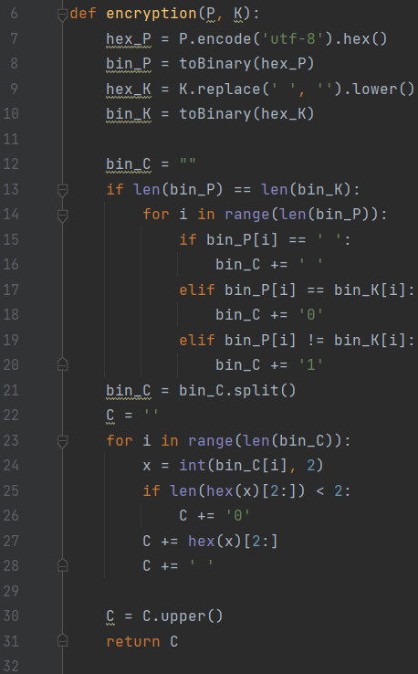
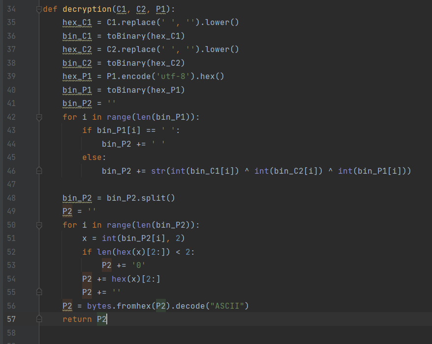
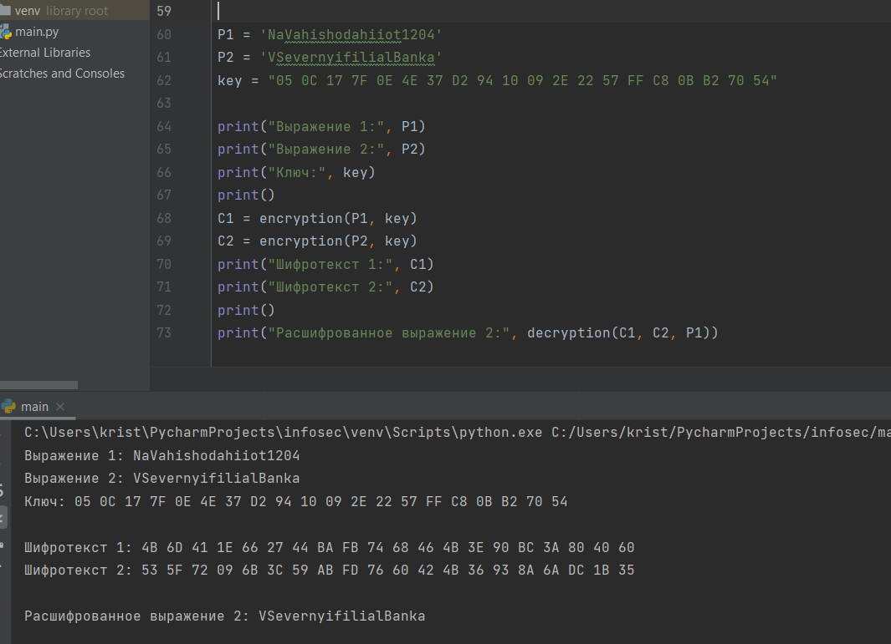

---
## Front matter
lang: ru-RU
title: "Лабораторная работа №8"
subtitle: "Элементы криптографии. Шифрование (кодирование) различных исходных текстов одним ключом"
author:
    Монастырская Кристина Владимировна
    НПИбд-02-19\inst{1}
institute: |
	\inst{1}RUDN University, Moscow, Russian Federation
date: 2022, 19 March, Moscow, Russian Federation  

## Formatting
mainfont: PT Serif
romanfont: PT Serif
sansfont: PT Sans
monofont: PT Mono
toc: false
slide_level: 2
theme: metropolis
header-includes: 
 - \metroset{progressbar=frametitle,sectionpage=progressbar,numbering=fraction}
 - '\makeatletter'
 - '\beamer@ignorenonframefalse'
 - '\makeatother'
 - \usepackage[T2A]{fontenc}
 - \usepackage{amsmath}
aspectratio: 43
section-titles: true
---

# Цель работы

Освоить на практике применение режима однократного гаммирования
на примере кодирования различных исходных текстов одним ключом.

# Задание

Два текста кодируются одним ключом (однократное гаммирование).  
P1 = НаВашисходящийот1204  
P2 = ВСеверныйфилиалБанка  

Требуется не зная ключа и не стремясь его определить, прочитать оба текста.  

Необходимо разработать приложение, позволяющее шифровать и дешифровать тексты P1 и P2 в режиме однократного гаммирования.  

Приложение должно определить вид шифротекстов C1 и C2 обоих текстов P1 и P2 при известном ключе и
P2 при известном ключе, а также должно дешифровать один из исходных текстов без использования ключа.

# Функция шифровки двух текстов с известным ключом

{ #fig:001 width=80% height=80% }

# Функция дешифровки сообщений без знания ключа.

{ #fig:002 width=80% height=80% }

# Итог

{ #fig:003 width=80% height=80% }

# Вывод

Освоили на практике применение режима однократного гаммирования
на примере кодирования различных исходных текстов одним ключом.
