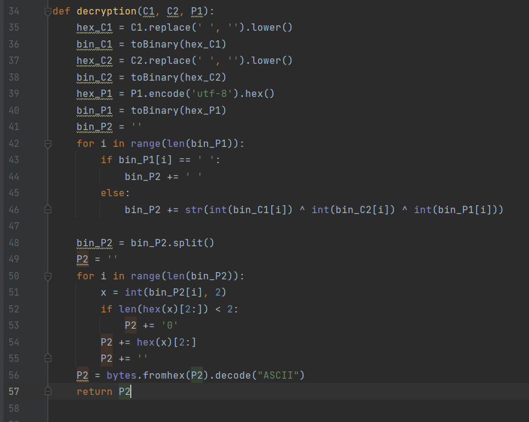
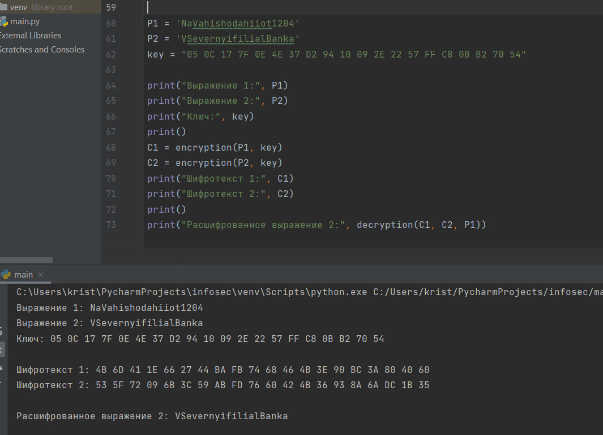

---
## Front matter
title: "Лабораторная работа №8"
subtitle: "Элементы криптографии. Шифрование (кодирование) различных исходных текстов одним ключом"
author: "Монастырская Кристина Владимировна"

## Generic options
lang: ru-RU
toc-title: "Содержание"

## Bibliography
bibliography: bib/cite.bib
csl: pandoc/csl/gost-r-7-0-5-2008-numeric.csl

## Pdf output format
toc: true # Table of contents
toc-depth: 2
lof: true # List of figures
lot: false # List of tables
fontsize: 12pt
linestretch: 1.5
papersize: a4
documentclass: scrreprt
## I18n polyglossia
polyglossia-lang:
  name: russian
  options:
	- spelling=modern
	- babelshorthands=true
polyglossia-otherlangs:
  name: english
## I18n babel
babel-lang: russian
babel-otherlangs: english
## Fonts
mainfont: PT Serif
romanfont: PT Serif
sansfont: PT Sans
monofont: PT Mono
mainfontoptions: Ligatures=TeX
romanfontoptions: Ligatures=TeX
sansfontoptions: Ligatures=TeX,Scale=MatchLowercase
monofontoptions: Scale=MatchLowercase,Scale=0.9
## Biblatex
biblatex: true
biblio-style: "gost-numeric"
biblatexoptions:
  - parentracker=true
  - backend=biber
  - hyperref=auto
  - language=auto
  - autolang=other*
  - citestyle=gost-numeric
## Pandoc-crossref LaTeX customization
figureTitle: "Рис."
tableTitle: "Таблица"
listingTitle: "Листинг"
lofTitle: "Список иллюстраций"
lotTitle: "Список таблиц"
lolTitle: "Листинги"
## Misc options
indent: true
header-includes:
  - \usepackage{indentfirst}
  - \usepackage{float} # keep figures where there are in the text
  - \floatplacement{figure}{H} # keep figures where there are in the text
---

# Цель работы

Освоить на практике применение режима однократного гаммирования
на примере кодирования различных исходных текстов одним ключом. [[1]](#список-литературы)

# Теоретическое введение

Гаммирование представляет собой наложение (снятие) на открытые (зашифрованные) данные последовательности элементов других данных, полученной с помощью некоторого криптографического алгоритма, для получения зашифрованных (открытых) данных. Иными словами, наложение гаммы — это сложение её элементов с элементами открытого (закрытого)
текста по некоторому фиксированному модулю, значение которого представляет собой известную часть алгоритма шифрования.
В соответствии с теорией криптоанализа, если в методе шифрования используется однократная вероятностная гамма (однократное гаммирование) той же длины, что и подлежащий сокрытию текст, то текст нельзя раскрыть.
Даже при раскрытии части последовательности гаммы нельзя получить информацию о всём скрываемом тексте.
Наложение гаммы по сути представляет собой выполнение операции сложения по модулю 2 (XOR) между элементами гаммы и элементами подлежащего сокрытию текста.
Такой метод шифрования является симметричным, так как двойное прибавление одной и той же величины по модулю 2 восстанавливает исходное значение, а шифрование и расшифрование выполняется одной и той же программой.
Открытый текст имеет символьный вид, а ключ — шестнадцатеричное
представление. Ключ также можно представить в символьном виде, воспользовавшись таблицей ASCII-кодов.

# Выполнение лабораторной работы

Два текста кодируются одним ключом (однократное гаммирование).  
P1 = НаВашисходящийот1204  
P2 = ВСеверныйфилиалБанка  

Требуется не зная ключа и не стремясь его определить, прочитать оба текста.  
Необходимо разработать приложение, позволяющее шифровать и дешифровать тексты P1 и P2 в режиме однократного гаммирования.  

Приложение должно определить вид шифротекстов C1 и C2 обоих текстов P1 и
P2 при известном ключе, а также должно дешифровать один из исходных текстов без использования ключа.

1. Реализовала функцию шифровки двух текстов сгенерированным в прошлом пункте ключом ([рис. 1](../images/1.jpg)). Использовала функцию, написанную в предыдущей работе и отредактировала её.

{ #fig:001 width=80% height=80% }

2. Реализовала функцию дешифровки сообщений без знания ключа([рис. 2](../images/2.jpg)). Функция совершает преобразование P1, C1 и C2 в двоичный код, после чего в P2 записывается результат побитовой операции сложения по модулю 2 с тремя элементами C1, C2, P1. Полученный битовый P2 переводится в шестнадцатиричную систему, а после в символьный текст.

{ #fig:002 width=80% height=80% }

3. Итог:

{ #fig:003 width=80% height=80% }

# Выводы

Освоили на практике применение режима однократного гаммирования на примере кодирования различных исходных текстов одним ключом.

# Список литературы{.unnumbered}

1. [Основы безопасности информационных систем : Учеб. пособие для студентов вузов, обучающихся по специальностям "Компьютер. безопасность" и "Комплекс. обеспечение информ. безопасности автоматизир. систем" / Д.А. Зегжда, А.М. Ивашко. - М. : Горячая линия - Телеком, 2000. - 449, [2] с. : ил., табл.; 21 см.; ISBN 5-93517-018-3](https://search.rsl.ru/ru/record/01000682756).

::: {#refs}
:::